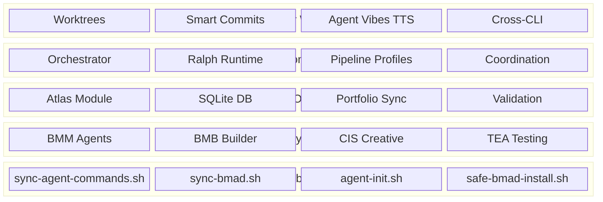
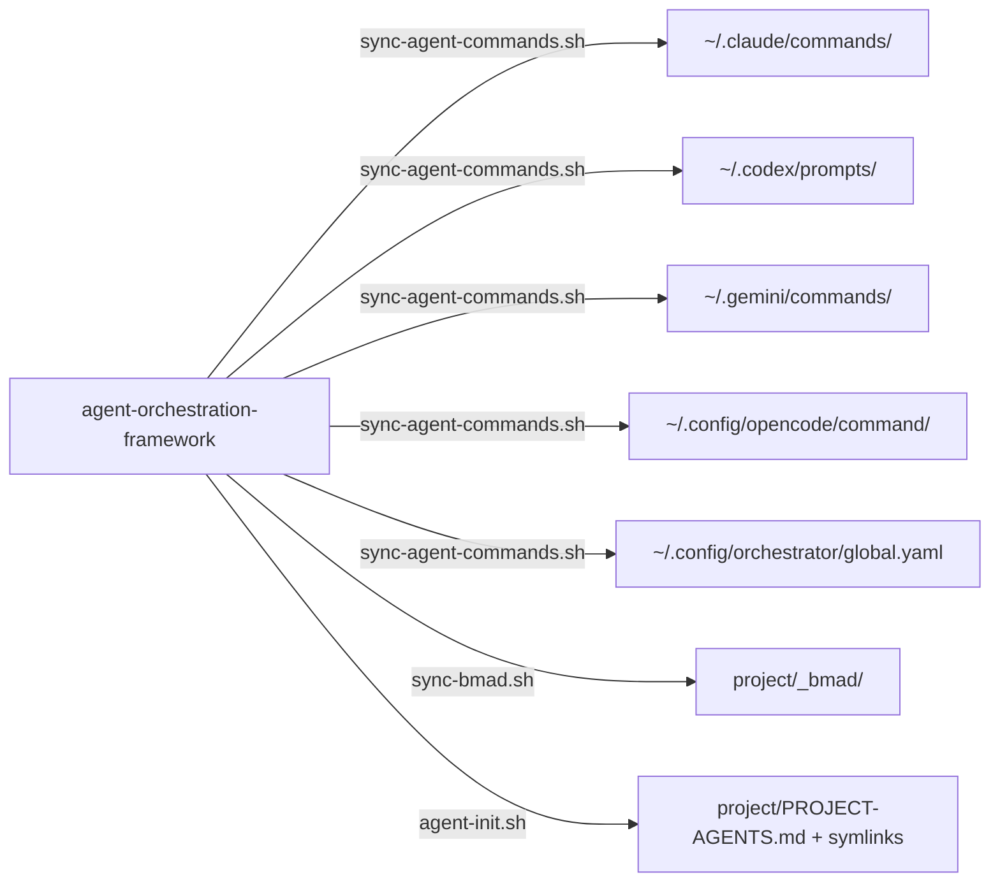
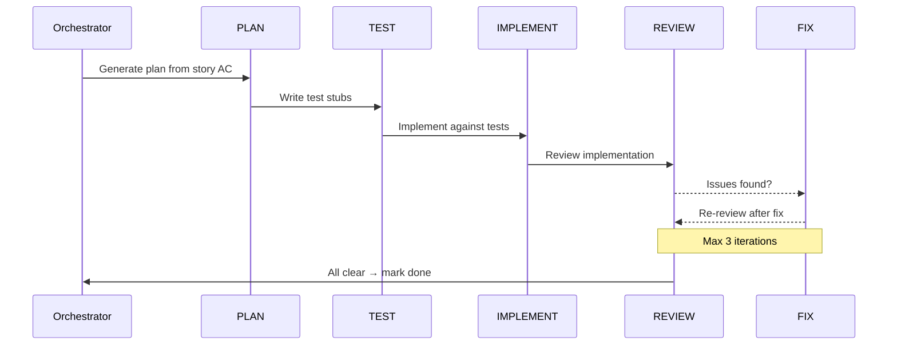
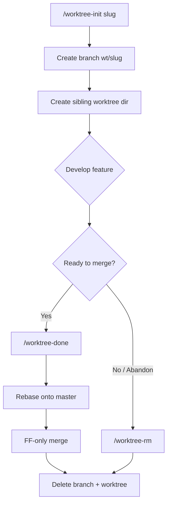
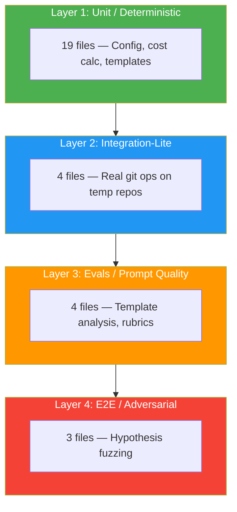

# The Agentic Coding Ecosystem

**Version**: 1.0.0
**Last Updated**: 2026-03-08
**Status**: Living Document

---

## Abstract

This document describes an **agentic coding ecosystem** built on top of four AI coding CLIs — Claude Code, Codex, Gemini CLI, and OpenCode — unified through shared configuration, autonomous orchestration, and portfolio-wide tooling. The system is designed to support a multi-project portfolio from a single source-of-truth repository (`agent-orchestration-framework`), distributing slash commands, BMAD v6 methodology modules, and execution workflows across projects.

**Audience**: Developers running multiple AI coding CLIs who want to unify them, and teams evaluating an orchestration layer for a multi-project portfolio.

> This is the standalone published edition. Raegis Labs-specific details (server identities, credential stores, client references) have been removed or generalised — what remains is the pattern as we run it, written so you can build your own from the components.

### How to Use This Document

| If you want to... | Go to... |
|---|---|
| Get started in 30 minutes | [Section 2: Quickstart](#2-quickstart) |
| Understand the design philosophy | [Section 3: Philosophy](#3-philosophy--design-principles) |
| See the system architecture | [Section 4: Architecture](#4-architecture-overview) |
| Learn about BMAD methodology | [Section 6: BMAD v6](#6-bmad-v6-framework) |
| Run autonomous story execution | [Section 7: Orchestrator & Ralph](#7-orchestrator--ralph) |
| Manage portfolio operations | [Section 8: Atlas](#8-atlas--portfolio-operations) |

---

## 2. Quickstart

**Goal**: Clone, sync, and run your first command in under 30 minutes.

### Prerequisites

| Tool | Minimum Version | Check |
|---|---|---|
| zsh | 5.8+ | `zsh --version` |
| git | 2.30+ | `git --version` |
| Node.js / npx | 18+ | `node --version` |
| Python 3 | 3.9+ | `python3 --version` |
| rsync | 3.x | `rsync --version` |
| Claude Code | Latest | `claude --version` |

Optional: Codex CLI (`codex --version`), Gemini CLI (`gemini --version`), OpenCode (`opencode --version`).

### Step 1: Create Your SSoT Repository

We run this from a single source-of-truth repository that distributes commands and modules to every project. Build your own — or start from the published components:

```bash
# Create your own SSoT repository
mkdir my-agent-framework && cd my-agent-framework && git init

# Bootstrap the multi-CLI config layer from the published starter
git clone https://github.com/raegislabs/multi-cli-agent-setup
cd multi-cli-agent-setup && ./install.sh
```

### Step 2: Bootstrap a Project

```bash
# In any target project
cd ~/your-project

# Initialize multi-CLI config (creates symlinks, PROJECT-AGENTS.md, .agentignore)
$REPO_ROOT/scripts/agent-init.sh .

# Optionally install BMAD v6 modules
npx bmad-method install
```

### Step 3: Verify

```bash
# In Claude Code, confirm the config loaded
claude
# Then type: /bmad-help   (or any command you synced in Step 1)
```

### Step 4: Set Up Global Agent Config (One-Time)

If you haven't already set up the global symlink architecture:

```bash
# Create the global config directory
mkdir -p ~/.agents-global

# Edit global rules (applied to ALL projects)
vim ~/.agents-global/AGENTS.md

# Symlink for each CLI
ln -sf ~/.agents-global/AGENTS.md ~/.claude/CLAUDE.md
ln -sf ~/.agents-global/AGENTS.md ~/.codex/AGENTS.md
ln -sf ~/.agents-global/AGENTS.md ~/.config/opencode/AGENTS.md
ln -sf ~/.agents-global/AGENTS.md ~/.gemini/GEMINI.md
```

For full details on the config architecture, see the [multi-cli-agent-setup](https://github.com/raegislabs/multi-cli-agent-setup) repository.

### Hello World Snippets

**Orchestrator** — run a freestyle task:
```
@orchestrator run --freestyle "Add input validation to the login form"
```

**Atlas** — check portfolio health:
```
@atlas
# Select: db-status
```

**Sync** — distribute custom modules to another project:
```bash
./scripts/sync-bmad.sh --project-only --target ../other-project --dry-run
```

**Worktree** — isolated feature development:
```
/worktree-commands:worktree-init auth-refactor
# ... work in isolated worktree ...
/worktree-commands:worktree-done
```

### Where to Get Help

- `/bmad-help` — Quick reference in Claude Code
- `BMAD-QUICKSTART.md` — Getting started guide
- `docs/canonical/bmad/` — Complete BMAD documentation
- `docs/test-architecture/runbooks/` — Testing runbooks
- Open a GitHub Issue for bugs or questions

---

## 3. Philosophy & Design Principles

### Multi-Model Philosophy

No single model excels at everything. This system routes tasks to the model best suited for them:

| Model/CLI | Strength | Use When |
|---|---|---|
| **Claude Code** (Opus/Sonnet) | Complex reasoning, nuanced code generation | Architecture decisions, code review consolidation, multi-file refactors |
| **Codex** (GPT-5.4) | Autonomous implementation, fast execution | Story implementation, autonomous refactoring, test generation |
| **Gemini CLI** (1M+ context) | Large-scale analysis | Codebase-wide audits, cross-file dependency analysis, security reviews |
| **OpenCode** | Alternative interface | Exploratory work, when primary CLIs are unavailable |
| **cg_d** (GLM 4.7 via Z.AI) | Autonomous coding | Alternative to Codex, long-running implementation tasks |

### Routing Matrix

| Task Type | Recommended CLI | Example |
|---|---|---|
| Implement a story | Codex | `codex exec -c approval_mode="full-auto" "Implement story 3-2"` |
| Review implementation | Codex + Gemini (parallel) | Orchestrator `default` profile |
| Large codebase audit | Gemini | `gemini -p "Security audit: @src/"` |
| Architecture decision | Claude | `claude -p "Evaluate these two approaches..."` |
| Quick bug fix | Claude or Codex | `/orchestrator:freestyle` |
| Cross-file refactor | Codex | `codex exec --sandbox workspace-write "Rename..."` |

### SSoT Principle

**Single Source of Truth** — every piece of configuration, every command, every module has exactly one canonical location. Everything else is a symlink or sync target.

```
agent-orchestration-framework/          ← SSoT repository
├── .claude/commands/          ← Canonical slash commands
├── _bmad/                     ← Canonical BMAD modules
├── scripts/                   ← Canonical sync + tooling
└── docs/                      ← Canonical documentation
         │
         ├──sync──→ ~/.claude/commands/        (user-level)
         ├──sync──→ ~/.codex/prompts/          (user-level)
         ├──sync──→ ~/.gemini/commands/        (user-level)
         ├──sync──→ ~/.config/opencode/command/ (user-level)
         ├──sync──→ ~/.config/orchestrator/global.yaml
         └──sync──→ <project>/_bmad/           (project-level)
```

### Composition Over Monolith

The system is composed of four independent layers that build on each other:

1. **Methodology** (BMAD v6) — Defines agents, workflows, and modules
2. **Portfolio Ops** (Atlas) — Database-backed lifecycle management
3. **Execution** (Orchestrator/Ralph) — Autonomous multi-backend pipelines
4. **Dev Workflows** — Worktrees, smart commits, TTS, cross-CLI invocation

Each layer can be used independently. You don't need Atlas to use BMAD. You don't need the Orchestrator to use Atlas. This composability means you can adopt one layer at a time:

1. Start with **BMAD v6** for structured development workflows
2. Add **Atlas** when you need cross-project tracking
3. Add the **Orchestrator** when you want autonomous execution
4. Use **Dev Workflows** (worktrees, smart commits) immediately — they're standalone

### CLI-Specific Design Considerations

Each CLI has different strengths that inform how the system uses them:

| CLI | Context Window | Autonomous Capability | Key Advantage |
|---|---|---|---|
| Claude Code | ~200K tokens | High (Agent/Task tools) | Nuanced reasoning, self-correction |
| Codex | ~128K tokens | Very High (`-c approval_mode="full-auto"`) | Fast autonomous execution, sandbox modes |
| Gemini | 1M+ tokens | Medium | Massive context, entire-codebase analysis |
| OpenCode | Varies | Medium | Alternative interface, model flexibility |

The Orchestrator exploits these differences: Codex for implementation speed, Gemini for whole-codebase reviews, Claude for consolidation and complex decisions.

### Publication Note

The architecture itself — symlink-based config, multi-CLI sync, orchestrated pipelines — is fully generic and reusable. Raegis-specific operational details were removed for this edition; where a section says "we run", read it as one concrete instance of the pattern, not the only way.

---

## 4. Architecture Overview

### System Architecture



**Key takeaways:**
- Layer 1 (BMAD) provides the methodology — agents, workflows, and domain modules
- Layer 2 (Atlas) adds persistent state via SQLite, enabling portfolio-wide tracking
- Layer 3 (Orchestrator) builds autonomous pipelines on top of Atlas
- Layer 4 (Dev Workflows) provides daily developer tooling
- Distribution (bottom) is a cross-cutting concern that syncs everything

### Repository Map

| Path | Purpose | Status |
|---|---|---|
| `_bmad/` | BMAD v6 modules — bmm, bmb, cis, core, tea | Active |
| `_bmad/orchestrator/` | Orchestrator module (canonical) | Active |
| `_bmad/atlas/` | Atlas portfolio operations module | Active |
| `_bmad/ralph/` | Ralph runtime state (session, scratchpad) | Active |
| `_bmad/project-database-master/` | Database management module | Active |
| `_bmad/_config/custom/` | Custom module configs (atlas, orchestrator, project-database-master) | Active |
| `.claude/commands/` | Canonical Claude command source (see generated inventory appendix for live counts) | Active |
| `.claude/hooks/` | Agent-vibes TTS hooks, session hooks | Active |
| `.codex/prompts/` | Codex prompt equivalents | Active |
| `.gemini/commands/` | Gemini command equivalents | Active |
| `.opencode/command/` | OpenCode command equivalents | Active |
| `scripts/` | Sync, tooling, and utility scripts/assets (see generated scripts appendix) | Active |
| `tests/ralph/` | 4-layer Ralph test suite | Active |
| `docs/` | Documentation, runbooks, architecture docs | Active |
| `skills/` | Skill definition library | Active |
| `src/` | Python utilities (speckit, etc.) | Active |
| `templates/` | Legacy BMAD v5-era (mostly empty) | Legacy |
| `bmad-v5-archive-20251228/` | Archived BMAD v5 content | Archive |
| `_bmad_archive/` | Deprecated orchestrator variants | Archive |
| `*-skill/` directories | Individual skill packages (5 dirs) | Mixed |
| `shared_utilities/` | Shared utility code | Active |
| `shared/` | Shared resources | Active |
| `workflows/` | Workflow definitions | Active |
| `specs/` | Feature specifications | Active |
| `data/` | Data files and fixtures | Active |
| `logs/`, `output/`, `tmp/` | Runtime output (gitignored) | Active |

#### Skill Directories

The repository contains several standalone skill packages, each providing Claude Code skill definitions:

| Directory | Contents | Purpose |
|---|---|---|
| `skills/` | Markdown skill definitions | Core skill definitions (the main collection) |
| `allure-testing-skill/` | Markdown skill package | Allure test reporting integration |
| `railway-skill/` | Markdown skill package | Railway.app deployment |
| `runpod-api-skill/` | Markdown skill package | RunPod API integration |
| `runpod-cli-skill/` | Markdown skill package | RunPod CLI operations |
| `tinybird-skill/` | Markdown skill package | Tinybird analytics integration |

#### Root-Level SQL Files (Legacy)

17 SQL files exist at the repository root — these are database migration and schema scripts from Atlas/project-database-master development. They should be moved to `backups/migration/` to reduce root clutter.

### Configuration & Distribution

#### Symlink Architecture

The system uses a two-level symlink fan-out to ensure all CLIs read identical instructions:

**Global (user-level):**
```
~/.agents-global/AGENTS.md          ← Single source of truth
    ↑ symlinked by:
    ├── ~/.claude/CLAUDE.md
    ├── ~/.codex/AGENTS.md
    ├── ~/.config/opencode/AGENTS.md
    └── ~/.gemini/GEMINI.md
```

**Project-level:**
```
PROJECT-AGENTS.md                   ← Single source of truth
    ↑ symlinked by:
    ├── .claude/CLAUDE.md
    ├── .codex/AGENTS.md
    ├── .opencode/AGENTS.md
    └── GEMINI.md
```

#### Sync Flow



**Key takeaways:**
- `sync-agent-commands.sh` handles user-level distribution (commands, prompts, global config)
- `sync-bmad.sh` handles project-level BMAD module distribution
- `agent-init.sh` bootstraps a new project with symlinks and `.agentignore`
- All syncs are idempotent, skip `*.local.*` files, and preserve permissions

#### Two-Tier Config (Orchestrator)

The Orchestrator uses a global + project-local config pattern:

| File | Location | Purpose | Size |
|---|---|---|---|
| `global.yaml` | `~/.config/orchestrator/global.yaml` | Backends, profiles, constraints, schemas | ~1,447 lines |
| `config.yaml` | `_bmad/orchestrator/config.yaml` | Project-specific paths, overrides | ~60 lines |

**Merge rules** (applied at workflow start):
- **Maps**: merge by key (project keys overlay global keys)
- **Lists**: project list replaces global list entirely
- **Scalars**: project value wins
- **YAML anchors**: live only in `global.yaml` (anchors cannot cross files)

#### `.agentignore`

The `.agentignore` file tells AI agents which directories to skip, reducing noise in codebase exploration:

```
.venv/
node_modules/
.git/
__pycache__/
dist/
build/
coverage/
```

---

## 5. Security & Secrets

### Principles

1. **Never commit secrets** — no `.env` files, tokens, or credentials in git
2. **Environment variables** — all runtime secrets via env vars or env files
3. **Centralized storage** — credentials managed through a secret manager

### Environment File Pattern

```
/etc/your-org/env/<project>.<env>.env    ← Centralized env files (chmod 640)
    ↑ symlinked by:
    └── /var/www/<project>/.env
```

Store credentials in a dedicated secrets manager (Bitwarden Secrets Manager, Infisical, or equivalent) and have deployment tooling fetch them at run time — never in the repo, never in shell history.

### Agent-Specific Security

AI coding agents introduce unique security considerations:

| Risk | Mitigation |
|---|---|
| Agent reads `.env` files | `.agentignore` excludes sensitive directories |
| Agent commits secrets | Pre-commit hooks scan for patterns (API keys, tokens) |
| Agent exposes internal URLs | `> Internal` callout convention separates public/private docs |
| Agent runs destructive commands | Codex sandbox modes (`read-only`, `workspace-write`) |
| Agent modifies shared state | Worktree isolation for parallel execution |

### For Open-Source Adopters

The pattern is generic:
1. Store env files outside the repo, with restricted permissions
2. Symlink from the project directory
3. Use your preferred secret manager (Vault, AWS SSM, 1Password, etc.)
4. Add `.env` and `*.env` to `.gitignore`
5. Use `.agentignore` to prevent AI agents from reading sensitive directories

---

## 6. BMAD v6 Framework

### What is BMAD?

**BMAD** (Build Methods for AI Development) is a methodology framework that structures AI-assisted software development into agents, workflows, and modules. It provides a consistent way to define development processes across any project.

For full documentation, see [bmadcodes.com](https://bmadcodes.com/).

### Core Modules

| Module | Full Name | Agent Count | Purpose |
|---|---|---|---|
| **BMM** | BMAD Method Modules | ~20 agents | Product management, development, QA, architecture, sprint management |
| **BMB** | BMAD Builder | ~5 agents | Building new agents, modules, and workflows |
| **CIS** | Creative & Innovation Suite | ~6 agents | Brainstorming, design thinking, storytelling, problem-solving |
| **TEA** | Test Engineering & Architecture | ~8 agents | Test design, automation, framework planning, CI/CD |
| **Core** | Core Framework | — | Base infrastructure, shared utilities |

### Custom Modules

These are project-specific or portfolio-wide extensions that live alongside core modules:

| Module | Purpose | Dual-Path Install |
|---|---|---|
| **Orchestrator** | Autonomous multi-backend execution pipelines | `_bmad/orchestrator/` + `_bmad/_config/custom/orchestrator/` |
| **Atlas** | Portfolio operations, SQLite-backed workflow DB | `_bmad/atlas/` + `_bmad/_config/custom/atlas/` |
| **Project Database Master** | Database schema management, migrations | `_bmad/project-database-master/` + `_bmad/_config/custom/project-database-master/` |

The "dual-path" install means each custom module has both a runtime location (`_bmad/<module>/`) and a configuration location (`_bmad/_config/custom/<module>/`).

### BMAD Directory Structure

A project with BMAD v6 installed has this structure:

```
_bmad/
├── bmm/               # Method Modules — PM, dev, QA, architect agents
├── bmb/               # Builder — create new agents, modules, workflows
├── cis/               # Creative & Innovation Suite
├── tea/               # Test Engineering & Architecture
├── core/              # Core framework infrastructure
├── _config/           # Configuration
│   └── custom/        # Custom module configs
│       ├── atlas/     # Atlas config + installer
│       ├── orchestrator/  # (empty in projects — uses global.yaml)
│       └── project-database-master/  # DB master config
├── _memory/           # Agent memory persistence
├── orchestrator/      # Orchestrator module (agents, workflows, config)
├── atlas/             # Atlas module (agents, workflows, config)
├── ralph/             # Ralph runtime state
└── project-database-master/  # Database management module
```

Core modules (`bmm`, `bmb`, `cis`, `tea`, `core`) are managed by the BMAD npm package. Custom modules (`orchestrator`, `atlas`, `project-database-master`) are managed by the `agent-orchestration-framework` repository and synced via `sync-bmad.sh`.

### How BMAD Agents Work

Each BMAD module contains **agents** (AI personas with specific expertise), **workflows** (step-by-step processes), and **extensions** (tools and scripts). When you invoke a command like `/bmad-create-prd`, it:

1. Activates the **PM agent** (product manager persona)
2. Loads the **create-prd workflow** (structured steps for PRD creation)
3. Uses extensions for validation, template generation, and quality checks
4. Produces artifacts (the PRD document) in standardized format

This separation of concerns means you can swap agents (use a different PM persona), customize workflows (add or remove steps), or extend functionality (new validation rules) without modifying the core framework.

### Installation & Sync

**Install BMAD v6 in a project:**
```bash
cd ~/your-project
npx bmad-method install
```

**Safe reinstall (preserves custom modules):**
```bash
$REPO_ROOT/scripts/safe-bmad-install.sh
```

**Sync custom modules from SSoT:**
```bash
cd $REPO_ROOT
./scripts/sync-bmad.sh --project-only --target ../your-project --dry-run
./scripts/sync-bmad.sh --project-only --target ../your-project
```

**What sync does and doesn't touch:**
- Syncs: `_bmad/_config/custom/`, custom module directories
- Skips: `*.local.*` files, `workflow.db*` artifacts, core BMAD modules (bmm, bmb, cis, core)
- Core modules are updated via `npx bmad-method install` or `safe-bmad-install.sh`

---

## 7. Orchestrator & Ralph

### Conceptual Overview

The **Orchestrator** is a BMAD v6 module that provides autonomous, multi-backend story execution. **Ralph** is its shell-level runtime — the process that manages sessions, state files, and heartbeats while the Orchestrator's BMAD agents handle workflow logic.

Think of it this way:
- The **Orchestrator** defines *what* to do (phases, profiles, backend selection)
- **Ralph** manages *how* it runs (sessions, locking, file I/O, cost tracking)

### Five-Phase Micro-Pipeline



**Key takeaways:**
- Each story passes through up to 5 phases: Plan → Test → Implement → Review → Fix
- Review can trigger Fix, which loops back to Review (max 3 iterations)
- Different backends can handle different phases (e.g., Codex implements, Gemini reviews)
- The pipeline is self-healing: review findings are automatically addressed

### Multi-Backend Routing

| Backend | CLI Invocation | Best For |
|---|---|---|
| `codex` | `codex exec -c approval_mode="full-auto"` | Autonomous implementation (default) |
| `gemini` | `gemini -p` | Large context analysis, cross-file reviews |
| `claude` | Task tool or `claude -p` | Complex reasoning, review consolidation |
| `cg_d` | Task tool or `cg_d -p` | GLM 4.7 via Z.AI, alternative to Codex |

**Smart routing**: When the orchestrator's session model matches the requested backend, it uses the Task tool (faster, shared context). When models differ, it shells out via Bash with the explicit CLI command.

### Execution Modes

| Mode | Command | Purpose |
|---|---|---|
| `run` | `@orchestrator run --epic=epic-2` | Execute stories in an epic |
| `freestyle` | `@orchestrator run --freestyle "..."` | Ad-hoc task, no story needed |
| `assess` | `@orchestrator run --assess "..."` | Analysis/audit, no code changes |
| `express` | `@orchestrator express` | Quick fix with minimal ceremony |
| `epic-run` | `@orchestrator epic-run epic-2` | Parallel execution of all ready stories |
| `prep-sprint` | `@orchestrator prep-sprint` | Prepare stories for sprint execution |
| `ready-tasks` | `@orchestrator ready-tasks` | Discover stories ready for implementation |

### Pipeline Profiles

The Orchestrator supports named pipeline profiles that configure which backend handles each phase:

| Profile | Development | Review | Fix | Use Case |
|---|---|---|---|---|
| `default` | Codex | Codex + Gemini (parallel) | Codex | Balanced quality + speed |
| `codex_only` | Codex | Codex | Codex | Fastest autonomous execution |
| `gemini_only` | Gemini | Gemini | Gemini | Large context workloads |
| `claude_traditional` | Claude | Claude | Claude | Maximum reasoning quality |
| `cg_d_only` | cg_d | cg_d | cg_d | GLM 4.7 pipeline |

The `default` profile uses **parallel merge review**: both Codex and Gemini review independently, then Claude consolidates findings, deduplicates, and assigns severity.

**Selecting a profile:**
```
@orchestrator run --profile codex_only --epic=epic-2
@orchestrator run --profile gemini_only --freestyle "Audit security"
```

**Overriding the backend for a specific phase:**
```
@orchestrator run --dev-backend gemini --epic=epic-2
```

**Priority order:** `--dev-backend` > `--backend` > `--profile` > `default`

### Codex Presets

When using the Codex backend, you can select a model/reasoning preset:

| Preset | Model | Reasoning | Use Case |
|---|---|---|---|
| `default` | GPT-5.4 | High | Recommended for most tasks |
| `balanced` | GPT-5.4 | Medium | Balance of speed and quality |
| `deep` | GPT-5.4 | High | Complex/critical tasks |
| `mini` | GPT-5.4-mini | Medium | Cost-effective for simple tasks |
| `fast` | GPT-5.4-mini | Low | Maximum speed, simpler tasks |

```
@orchestrator run --codex-preset mini --epic=epic-2
```

### Smart Routing (Session Detection)

The Orchestrator detects the current session's model to optimize tool selection:

1. Check environment: `echo $ANTHROPIC_BASE_URL $ANTHROPIC_DEFAULT_SONNET_MODEL`
2. If URL contains `z.ai` → session is GLM (cg_d)
3. Otherwise → session is Claude

**Tool selection logic:**

| Requested Backend | Session Model | Tool Used |
|---|---|---|
| `claude` | Claude | Task tool (faster, shared context) |
| `claude` | GLM | Bash: `claude -p` (explicit CLI) |
| `cg_d` | GLM | Task tool (faster, shared context) |
| `cg_d` | Claude | Bash: `cg_d -p` (explicit CLI) |
| `codex` | Any | Bash: `codex exec` (always CLI) |
| `gemini` | Any | Bash: `gemini -p` (always CLI) |

When the session model matches the requested backend, the Task tool is used because it's faster and shares context. When they differ, the system shells out to the explicit CLI to ensure the correct model handles the work.

### Coordination

| Feature | Description |
|---|---|
| **Heartbeat locking** | Parallel agents acquire locks with auto-expiry to prevent conflicts |
| **File conflict detection** | Detects when multiple agents try to modify the same files |
| **Milestone auto-commits** | Configurable auto-commits at story, epic, and final completion |
| **Cost tracking** | Tracks API costs per session for budget governance |
| **Session state** | Persisted in `_bmad/ralph/session.json` |

### Common Failure Modes

| Symptom | Diagnosis | Resolution |
|---|---|---|
| "No ready stories found" | Atlas DB not initialized or no stories in `ready` state | Run `@atlas db-init-project`, then `@orchestrator prep-sprint` |
| Backend CLI not found | CLI not installed or not on PATH | Install the CLI, verify with `which codex` / `which gemini` |
| Heartbeat lock stuck | Previous session crashed without cleanup | Delete stale lock file in `_bmad/ralph/` |
| Review loop exceeds max iterations | Fix phase not resolving issues | Increase `max_iterations` in profile or manually fix |
| Session model detection fails | Environment variables not set | Check `echo $ANTHROPIC_BASE_URL` |

### Config Reference

Key sections in `global.yaml` (1,447 lines):

| Section | Purpose |
|---|---|
| `session_detection` | Smart routing: detect session model, optimize tool selection |
| `orchestration.backends` | Backend definitions (codex, gemini, claude, cg_d) |
| `pipeline_profiles` | Named profiles with per-phase backend assignments |
| `_phase_defaults` | YAML anchors for reusable phase configurations |

See `_bmad/orchestrator/global.yaml` for the full reference.

---

## 8. Atlas — Portfolio Operations

### Purpose

Atlas is the **portfolio operations layer** — a SQLite-backed workflow database that tracks projects, epics, and stories across your entire BMAD ecosystem. It provides the persistent state that the Orchestrator needs to know which stories are ready, in progress, or done.

### Capabilities

| Capability | Commands | Description |
|---|---|---|
| **Database Management** | `db-init-project`, `db-status` | Initialize projects, check health |
| **Story Lifecycle** | `create-story`, `update-story` | Create, update, transition story states |
| **Portfolio Sync** | `portfolio-sync` | Sync custom modules across all projects |
| **Validation** | `validate-bmad-structure`, `validate-bmad-commands` | Check BMAD integrity |
| **Documentation** | `document-project` | Generate brownfield project docs |
| **Analytics** | `project-context` | Story sizing, epic progress, health metrics |

### Installation

```bash
# In Claude Code, inside any BMAD v6 project:
/add-atlas

# This installs Atlas to both:
#   _bmad/atlas/           (runtime)
#   _bmad/_config/custom/atlas/  (config)
```

### Database Schema

Atlas uses a SQLite database (`~/_bmad/workflow.db`) with these core tables:

| Table | Purpose |
|---|---|
| `projects` | Project metadata, stack detection, config |
| `epics` | Epic definitions with sizing and priority |
| `stories` | Stories with acceptance criteria, size estimates, state |
| `workflow_steps` | Step-level tracking within stories |
| `analytics` | Sizing metrics, velocity data |

**Story lifecycle states:** `draft` → `ready` → `in_progress` → `review` → `done` (or `blocked`)

### Orchestrator Integration

Atlas is the data backbone for the Orchestrator:
- Stories are created and sized in Atlas → Orchestrator picks them up via `ready-tasks`
- As stories progress through the pipeline, Atlas status is updated atomically
- Epic completion triggers milestone commits and status rollups
- Cost tracking data is written back to Atlas for budget governance

### How to Use

```bash
# Open the Atlas interactive menu
@atlas

# Options include:
# 1. db-init-project     — Initialize current project in the database
# 2. portfolio-sync      — Sync custom modules from SSoT
# 3. validate-structure  — Check BMAD directory integrity
# 4. project-context     — Generate context summary
# 5. advanced-menu       — Database operations, Linear sync
```

Issue-tracker integration (Linear, GitHub Issues, or similar) is optional. The pattern: a small CLI wrapper (`linctl` in our case) that agents can call, plus a sync workflow that maps tracker issues to local story files.

---

## 9. Slash Command System

### Architecture

Claude Code is the canonical command source, and the generated appendices capture the current command surface for each CLI:

| CLI | Location | Format | Notes |
|---|---|---|---|
| Claude Code | `.claude/commands/` | Markdown (`.md`) | Canonical source; see the generated appendix for current counts |
| Codex | `.codex/prompts/` | Markdown (`.md`) | Native prompt set plus sync-time fallback from top-level Claude commands |
| Gemini | `.gemini/commands/` | TOML (`.toml`) | Native Gemini command set |
| OpenCode | `.opencode/command/` | Markdown (`.md`) | Native OpenCode command set |

**Codex fallback**: Codex ships a smaller native prompt set focused on orchestrator/spec-kit/worktree flows. During sync, `sync-agent-commands.sh` also copies missing top-level Claude commands into `~/.codex/prompts/`, which preserves broad coverage while allowing Codex-specific prompts to take priority.

### Command Categories

| Category | Representative examples |
|---|---|
| BMAD BMM (Method) | `bmad-create-prd`, `bmad-sprint-planning`, `bmad-code-review` |
| BMAD BMB (Builder) | `bmad-bmb-create-agent`, `bmad-bmb-create-workflow` |
| BMAD CIS (Creative) | `bmad-cis-storytelling`, `bmad-cis-design-thinking` |
| BMAD TEA (Testing) | `bmad-testarch-automate`, `bmad-testarch-ci` |
| Agent Vibes (TTS) | `agent-vibes:mute`, `agent-vibes:switch`, `agent-vibes:personality` |
| Orchestrator | `orchestrator:freestyle`, `orchestrator:assess`, `orchestrator:run` |
| Worktree | `worktree-commands:worktree-init`, `worktree-commands:worktree-done`, `worktree-commands:worktree-rm` |
| Commit | `commit-commands:smart-commit-and-review`, `commit-commands:smart-commit-no-review` |
| Spec Kit | `speckit.plan`, `speckit.implement`, `speckit.clarify` |
| Atlas | `bmad-atlas-portfolio-sync`, `bmad-atlas-validate-bmad-commands` |
| Other | `bmad-help`, `bmad-workflow`, `bmad-party-mode`, `desloppify` |

For the full inventory with descriptions, see [Appendix: Command Inventory](appendix-command-inventory.md).

### Sync Mechanism

```bash
# Sync all user-level commands and prompts
./scripts/sync-agent-commands.sh

# Flags:
#   --dry-run     Preview what will be synced
#   --delete      Remove commands not in SSoT (careful!)
#   --verbose     Show detailed rsync output
```

**What gets synced:**
- `.claude/commands/` → `~/.claude/commands/`
- `.codex/prompts/` → `~/.codex/prompts/`
- `.gemini/commands/` → `~/.gemini/commands/`
- `.opencode/command/` → `~/.config/opencode/command/`
- `_bmad/orchestrator/global.yaml` → `~/.config/orchestrator/global.yaml`

**Failure modes:**
- Commands not appearing after sync → Restart Claude Code (it caches commands on startup)
- Permission errors → `chmod +x scripts/sync-agent-commands.sh`
- Partial sync → Re-run; the script is idempotent

### Adding New Commands

1. Create `.claude/commands/<category>/<command-name>.md`
2. Add YAML frontmatter: `description`, `argument_description` (optional)
3. Write the command prompt in Markdown
4. Optionally create equivalents in `.codex/prompts/`, `.gemini/commands/`, `.opencode/command/`
5. Run `./scripts/sync-agent-commands.sh` to distribute

### Agent Vibes (TTS)

Agent Vibes is a text-to-speech system that provides audio feedback during agent work sessions. It uses macOS `say` command (or Piper TTS) to speak status updates.

**Quick usage:**
```bash
# Mute/unmute
/agent-vibes:mute
/agent-vibes:unmute

# Change voice
/agent-vibes:switch

# Set verbosity
/agent-vibes:verbosity
```

**Hooks location:** `.claude/hooks/` — includes `play-tts.sh`, voice managers, audio processors, and the TTS queue system.

**To disable completely:** Mute via `/agent-vibes:mute` or remove the TTS hooks from `.claude/hooks/hooks.json`.

---

## 10. Developer Workflow Tools

### Terminal Environment: cmux

The terminal environment is **cmux** — a native macOS terminal built on Ghostty's rendering engine (libghostty), purpose-built for multi-agent AI workflows. It replaces the previous WezTerm + Zellij and standalone Ghostty + Zellij setups.

**Why cmux over standalone terminals:**
- **Notification integration** — blue ring indicators in the sidebar when Claude Code or Codex need input
- **Workspace management** — per-project workspaces with color coding, sidebar metadata (git branch, PR status, listening ports)
- **Split panes** — side-by-side agent sessions (Cmd+D) with dimmed unfocused panes (`unfocused-split-opacity = 0.7`)
- **Built-in browser** — split browser alongside terminal for dev server/Swagger UI viewing
- **Markdown viewer** — `cmux markdown open file.md` for formatted in-terminal rendering
- **Session restore** — workspace layout, working directories, and scrollback persist across restarts
- **Socket API** — 90+ CLI commands for programmatic workspace/pane/notification control

**Configuration files:**

| File | Purpose |
|------|---------|
| `~/Library/Application Support/com.cmuxterm.app/config.ghostty` | Terminal rendering (Ghostty format) |
| `~/.config/ghostty/ghostty-launcher.sh` | Project launcher (creates cmux workspaces) |
| `~/.local/bin/cmux-agent-workspace` | Multi-agent workspace launcher script |

**Key terminal settings** (in `config.ghostty`):
- `scrollback-limit = 100000` — agents produce massive output
- `copy-on-select = clipboard` — select text in one pane, paste in another
- `unfocused-split-opacity = 0.7` — see which pane has focus at a glance
- `shell-integration-features = cursor,sudo,title` — prompt markers for navigating long sessions

**Agent notification integration:**
- **Claude Code**: Built-in hooks (`cmux claude-hook`) — sidebar shows "Running" / "Needs input"
- **Codex**: Configured via `notify` in `~/.codex/config.toml` — `cmux notify --title Codex --body "Task complete"`

**Workspace color scheme** (set via project launcher): give each workspace category its own color so a glance tells you which world a pane belongs to:

| Category | Color | Hex |
|----------|-------|-----|
| Internal / core | Blue | `#1565C0` |
| Client work | Green | `#2E7D32` |
| Products | Purple | `#6A1B9A` |
| Consulting | Orange | `#E65100` |
| Personal | Amber | `#F57F17` |

**CLI quick reference:**
```bash
cmux tree                                    # Show workspace/pane hierarchy
cmux markdown open file.md                   # Formatted markdown viewer
cmux notify --title "X" --body "Y"           # Send notification
cmux new-workspace --cwd ~/project           # Create workspace
cmux new-split                               # Split current pane (Cmd+D)
cmux-agent-workspace "Name" /path --split    # Multi-agent workspace with split
```

> **Full configuration reference**: See `docs/canonical/ghostty/README.md`

### Git Worktree Management

Worktrees provide isolated branches for parallel feature development without `git stash` or branch-switching overhead.

**Layout:** Sibling directories next to the main repo:
```
~/project/                    ← Main working directory
~/project-wt-auth-refactor/   ← Worktree for auth work
~/project-wt-fix-login/       ← Worktree for login fix
```

**Three canonical commands:**

| Command | Purpose |
|---|---|
| `/worktree-commands:worktree-init <slug>` | Create worktree + branch `wt/<slug>` |
| `/worktree-commands:worktree-done` | Rebase onto master, ff-only merge, cleanup |
| `/worktree-commands:worktree-rm` | Remove worktree without merging |



**Decision tree:**
- **Use worktree** when: parallel feature work, risky experiments, orchestrator multi-agent execution
- **Don't use worktree** when: quick single-file fix, already on a feature branch

**Shell functions** (sourced from `~/.config/zsh/worktree-functions.zsh`):
- `wt_init <slug>` — Create worktree
- `wt_done` — Rebase + merge + cleanup
- `wt_rm` — Remove without merge

**Worktree merge strategy:**
The system uses **rebase + fast-forward-only merge** to maintain a clean, linear history:
1. `wt_done` rebases the worktree branch onto the latest `master`
2. Switches back to main repo directory
3. Performs `git merge --ff-only wt/<slug>`
4. Deletes the worktree directory and branch

This ensures no merge commits clutter the history. If the rebase has conflicts, you resolve them in the worktree before the merge proceeds.

**Orchestrator + Worktrees:**
The Orchestrator can use worktrees for isolated agent execution. When running in `epic-run` mode with multiple stories, each story can be assigned its own worktree to prevent file conflicts between parallel agents.

### Smart Commit System

Two variants for organizing uncommitted changes into atomic, conventional commits:

| Command | Description |
|---|---|
| `/commit-commands:smart-commit-and-review` | Groups changes → Codex reviews each group → commits |
| `/commit-commands:smart-commit-no-review` | Groups changes → commits directly (faster) |

**How it works:**
1. **Pre-flight**: Checks for rebase/merge/cherry-pick in progress; handles pre-staged files
2. **Analysis**: Scans all uncommitted changes (staged, unstaged, untracked)
3. **Grouping**: Clusters related changes into logical atomic commits based on:
   - File proximity (same directory/module)
   - Change type (feature vs. fix vs. refactor)
   - Dependency relationships (model + migration together)
4. **Conventional messages**: Generates `feat:`, `fix:`, `chore:`, `refactor:`, `test:`, `docs:` prefixes
5. **Review** (with-review variant): Sends each commit group to Codex (GPT-5.4 high reasoning) for review before committing
6. **Commit**: Creates atomic commits in dependency order

**Example output:**
```
Commit 1: feat(auth): add password strength validation
  - src/auth/validators.py (new)
  - tests/auth/test_validators.py (new)

Commit 2: fix(api): handle null user in session middleware
  - src/api/middleware.py (modified)

Commit 3: chore: update dependencies
  - requirements.txt (modified)
  - pyproject.toml (modified)
```

### Agent Init Bootstrap

`scripts/agent-init.sh` bootstraps any project for multi-CLI agent use:

```bash
./scripts/agent-init.sh [path] [--dry-run] [--force] [--minimal]
```

**What it creates:**
- `PROJECT-AGENTS.md` from template (if missing)
- Symlinks: `.claude/CLAUDE.md`, `.codex/AGENTS.md`, `GEMINI.md`, `.opencode/AGENTS.md`
- `.agentignore` (if missing)
- Codex trusted project entry

**What it does NOT do:**
- Install `_bmad/` (use `npx bmad-method install` separately)
- Modify existing files (use `--force` to overwrite)
- Touch git config or make commits

### Cross-CLI Invocation Patterns

Agents can spawn other CLIs for specialized tasks:

```bash
# Pattern 1: Claude orchestrates, Gemini analyzes
gemini -p "Analyze security of: @src/ @lib/"

# Pattern 2: Claude orchestrates, Codex implements
codex exec --sandbox workspace-write -c approval_mode="full-auto" \
  "Implement the refactoring plan in docs/plan.md"

# Pattern 3: Multi-stage pipeline
gemini -p "Find technical debt: @src/" > /tmp/debt.md
claude -p "Prioritize: $(cat /tmp/debt.md)"
codex exec "Fix top priority..."

# Pattern 4: Parallel execution
gemini -p "Security audit: @src/" &
claude -p "Architecture review: $(cat src/main.py)" &
wait
```

**JSON handoff contracts** — for structured delegation between CLIs, use the schema at `~/.config/agents/task-contract.schema.json`. Key fields: `goal`, `context.repo_sha`, `context.key_files`, `constraints`, `findings`, `next_actor`.

---

## 11. Testing Architecture

### Four-Layer Pyramid



**Key takeaways:**
- The pyramid is bottom-heavy by design: most tests are fast, deterministic unit tests
- Integration-lite tests use real git operations on temporary repositories
- Evals test prompt quality through static template analysis and rubric scoring
- E2E tests use Hypothesis for adversarial property-based testing

### Per-Layer Details

| Layer | Directory | Files | Run Command | Duration |
|---|---|---|---|---|
| 1. Unit | `tests/ralph/unit/` | 19 | `pytest tests/ralph/unit/ -n auto --timeout=10` | ~30s |
| 2. Integration-Lite | `tests/ralph/integration-lite/` | 2 | `pytest tests/ralph/integration-lite/ --timeout=30` | ~1m |
| 3. Evals | `tests/ralph/evals/` | 3 | `pytest tests/ralph/evals/ --timeout=60` | ~2m |
| 4. E2E | `tests/ralph/e2e/` | 3 | `pytest tests/ralph/e2e/ --timeout=300` | ~5m |

The Ralph module has 31 test files total. The broader `tests/` directory contains 104 test files across unit, integration, MCP, performance, and other categories.

Additional directories: `tests/ralph/sandbox/` (experimental), `tests/ralph/fixtures/` (shared test data, mock responses, test projects), `tests/ralph/integration/` (full integration).

### What Each Layer Tests

**Layer 1 — Unit (Deterministic TDD):**
Config parsing, cost calculation formulas, template rendering, sandbox execution, new feature unit tests. These are fast, hermetic, and parallelizable. No external dependencies.

**Layer 2 — Integration-Lite (Real Git):**
Creates temporary git repositories, runs real git operations (init, commit, branch, worktree), and validates that the orchestrator's git-dependent features work correctly. Tests use `pytest-tmp-dir` for isolation.

**Layer 3 — Evals (Prompt Quality):**
Static analysis of prompt templates and rubric-based scoring. Tests include datasets (`tests/ralph/evals/datasets/`) and rubrics (`tests/ralph/evals/rubrics/`) that grade prompt quality without making API calls.

**Layer 4 — E2E (Adversarial Fuzzing):**
Uses the [Hypothesis](https://hypothesis.readthedocs.io/) library for property-based testing. Generates random inputs to stress-test parsing, config loading, and edge cases that manual tests would miss.

### Test Profiles

**Fast lane** (< 5 minutes, for pull requests):
```bash
export REGRESSION_MCP_ENABLED=0
export OBSERVABILITY_REPLAY=0
pytest -m "not slow and not integration and not regression and not performance" \
  -n auto --timeout=10 --strict-markers
```

**Full lane** (< 10 minutes, nightly + main):
```bash
export REGRESSION_MCP_ENABLED=1
export OBSERVABILITY_REPLAY=1
pytest -n 4 --timeout=300
```

### Coverage Governance

`scripts/coverage_gatekeeper.py` enforces risk-tier coverage thresholds:

| Risk Tier | Threshold | Examples |
|---|---|---|
| CLI | 85% | Command-line interface code |
| Registry | 90% | Module registries, lookups |
| Monitoring | 75% | Observability, metrics |
| Maintenance | 70% | Utility scripts, helpers |
| **Global floor** | **70%** | All code combined |

```bash
python3 scripts/coverage_gatekeeper.py \
  --check \
  --coverage-json output/test_reports/coverage/coverage.json \
  --summary-path output/test_reports/coverage/coverage_summary.json
```

### Marker Governance

Tests running longer than 2 seconds must carry a governance marker (`slow`, `integration`, `regression`, `performance`). Enforced by `scripts/verify_markers.py`.

### Observability

`ObservabilityCollector` writes NDJSON events and Prometheus gauges to `output/test_reports/metrics.txt`. Use this for:
- `suite_duration_seconds` budget checks
- Flaky test detection
- Dashboard integration

---

## 12. Deprecated & Archivable Content

| Item | Status | Recommended Action | Risk if Kept |
|---|---|---|---|
| ~~`templates/`~~ | ~~Empty, BMAD v5-era~~ | ~~Removed~~ | ✅ Done |
| `bmad-v5-archive-20251228/` | Already archived | Keep as-is | None |
| `_bmad_archive/orchestrator-deprecated/` | Old orchestrator variants | Keep as archive reference | None |
| ~~`allure-testing-skill/`~~ | ~~Skill package, last modified Nov 2025~~ | ~~Archived to `_archived_skills/`~~ | ✅ Done |
| ~~`railway-skill/`~~ | ~~Skill package, last modified Oct 2025~~ | ~~Archived to `_archived_skills/`~~ | ✅ Done |
| ~~`runpod-api-skill/`~~ | ~~Skill package, last modified Nov 2025~~ | ~~Archived to `_archived_skills/`~~ | ✅ Done |
| ~~`runpod-cli-skill/`~~ | ~~Skill package, last modified Nov 2025~~ | ~~Archived to `_archived_skills/`~~ | ✅ Done |
| ~~`tinybird-skill/`~~ | ~~Skill package, last modified Nov 2025~~ | ~~Archived to `_archived_skills/`~~ | ✅ Done |
| ~~`.codemachine/`~~ | ~~Legacy code gen, 169 files~~ | ~~Archived to `_archived/`~~ | ✅ Done |
| ~~17 loose SQL files at root~~ | ~~Migration/schema scripts~~ | ~~Moved to `backups/migration/`~~ | ✅ Done |

**Retention rule**: If a directory hasn't been modified in 90 days and has no active consumers, archive it to `_archived/<name>/` with a dated README explaining why.

### Completed Cleanup Actions

1. ✅ Moved 17 root SQL files to `backups/migration/`
2. ✅ Removed empty `templates/` directory
3. ✅ Updated README.md: removed `.codemachine/` reference, added `tests/` entry

### Completed Planned Actions

4. ✅ Archived 5 inactive `*-skill/` directories → `_archived_skills/` (all last modified Oct-Nov 2025, 1-2 commits each)
5. ✅ Archived `.codemachine/` → `_archived/codemachine-archived-20260308/` (169 files, last modified Dec 2025)
6. ✅ Consolidated Linear docs → `docs/linear-integration.md` (merged `README-Linear-Integration.md` + `docs/linear-mcp-guidance.md`)

---

## 13. Gaps & Roadmap

### Addressed by This Document

| Gap | Resolution |
|---|---|
| No unified getting-started guide | Section 2: Quickstart |
| Agent Vibes undocumented | Section 9: Agent Vibes primer |
| `agent-init.sh` not in README | Section 10: Agent Init Bootstrap |
| Architecture not visualized | Section 4: Mermaid diagrams |

### Open Items

| Gap | Priority | Suggested Action |
|---|---|---|
| No `CHANGELOG.md` | Medium | Create as a separate file, update on each release |
| Test docs not linked from top-level README | Low | Add link to `docs/test-architecture/` in README |
| `*-skill/` directories have unclear status | Medium | Audit each, archive inactive ones to `_archived_skills/` |
| No support/issue escalation path | Low | Add for open-source: GitHub Issues template |
| No sync script error recovery guide | Low | Document common rsync errors and recovery in sync script README |
| No project portfolio list | Medium | Create `docs/portfolio.md` listing all 34 projects |
| ~~Linear integration docs scattered~~ | ~~Low~~ | ~~Consolidated into `docs/linear-integration.md`~~ ✅ |

---

## 14. Quick Reference

### Top 20 Commands

| Command | Description |
|---|---|
| `./scripts/sync-agent-commands.sh` | Sync commands to all CLIs |
| `./scripts/sync-bmad.sh --project-only --target <dir>` | Sync BMAD modules to project |
| `./scripts/agent-init.sh <dir>` | Bootstrap project for multi-CLI |
| `./scripts/safe-bmad-install.sh` | Reinstall BMAD, preserve customs |
| `/bmad-help` | BMAD quick reference |
| `/bmad-workflow` | Start a BMAD workflow |
| `@orchestrator run --epic=<epic>` | Execute stories in an epic |
| `@orchestrator run --freestyle "..."` | Ad-hoc task execution |
| `@orchestrator express` | Quick fix workflow |
| `@atlas` | Open Atlas interactive menu |
| `/add-atlas` | Install Atlas module |
| `/worktree-commands:worktree-init <slug>` | Create isolated worktree |
| `/worktree-commands:worktree-done` | Merge and cleanup worktree |
| `/commit-commands:smart-commit-and-review` | Atomic commits with review |
| `/agent-vibes:mute` | Mute TTS audio |
| `/desloppify` | Code quality scan |
| `/bmad-code-review` | BMAD code review |
| `/bmad-create-prd` | Create product requirements doc |
| `/bmad-testarch-automate` | Automate test architecture |
| `pytest -m "not slow" -n auto` | Run fast test suite |

### Troubleshooting FAQ

<details>
<summary><strong>Commands not appearing after sync</strong></summary>

Restart Claude Code — it caches the command list on startup. Verify sync succeeded:
```bash
ls ~/.claude/commands/ | head -20
```
</details>

<details>
<summary><strong>Worktree conflicts on merge</strong></summary>

If `/worktree-done` fails during rebase:
1. Resolve conflicts in the worktree directory
2. `git rebase --continue`
3. Run `/worktree-done` again

Or abandon: `/worktree-rm`
</details>

<details>
<summary><strong>Session model detection failures</strong></summary>

The orchestrator detects the session model via environment variables:
```bash
echo $ANTHROPIC_BASE_URL $ANTHROPIC_DEFAULT_SONNET_MODEL
```
If these aren't set, it defaults to `claude`. To force a backend:
```
@orchestrator run --backend codex --epic=epic-2
```
</details>

<details>
<summary><strong>Config merge issues</strong></summary>

If project config isn't overriding global config:
1. Verify `_bmad/orchestrator/config.yaml` exists and has valid YAML
2. Check merge rules: maps merge by key, lists replace, scalars project wins
3. YAML anchors (`&name`/`*name`) only work within `global.yaml` — don't reference them in project config
</details>

<details>
<summary><strong>Atlas database not found</strong></summary>

Initialize the database:
```bash
@atlas
# Select: db-init-project
```

The global database lives at `~/_bmad/workflow.db`. Per-project state is linked from there.
</details>

---

*Generated 2026-03-08. For the latest version, see the `agent-orchestration-framework` repository.*
